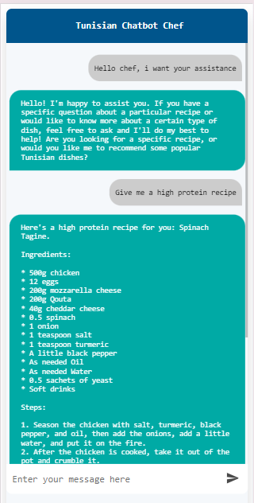

# LLM Model Integration and Architecture

## Overview
The Tunisian Kitchen Assistant Bot leverages a fine-tuned **LLaMA3** model from **LangChain** integrated with the **Tavily** web search API for enhanced information retrieval. The application uses a **Retrieval-Augmented Generation (RAG)** technique, where the model generates responses based on a combination of pre-loaded recipes and real-time web search results, ensuring that responses are both relevant and factual.

This section explains how the **LLaMA3** model is utilized within the application, including the architecture of the custom nodes and the RAG workflow.

## Model Architecture and Flow
The application is built using a **StateGraph** workflow that defines the process of information retrieval, content generation, and filtering, ensuring that the user's input is accurately processed and responses are generated without hallucinations.

### Components

- **LLaMA3 Model from LangChain**:
  - The model is invoked to process both pre-loaded documents (Tunisian recipes) and web search results, using a fine-tuned version of **LLaMA3** specifically adapted for natural language understanding related to cooking queries.
  - Fine-tuning ensures that the model can generate culturally authentic and relevant recipes.

- **Tavily Web Search API**:
  - Tavily is integrated for handling real-time web searches, expanding the model's capabilities by retrieving live content when a query is not fully answerable by the pre-loaded documents alone.
  - This API returns high-quality, relevant search results that are subsequently passed to the LLaMA3 model for enhanced generation.

## Workflow and StateGraph
The entire process is controlled by a **StateGraph**, which governs how different nodes interact to generate the final output. Below is a breakdown of the key nodes in the workflow:

- **Classification Node (`classify_relevance`)**:
  - The user’s input (task) is classified to determine if it is relevant to the document analysis or if it can directly trigger response generation.
  - If relevant, the input is passed to document analysis; otherwise, it goes straight to content generation.

- **Document Analysis Node (`agent_for_document_analysis_node`)**:
  - If classified as relevant, the model analyzes the pre-loaded recipe documents stored in a specific folder.
  - This node uses LangChain's CSV agent (`create_csv_agent`) to query and analyze Tunisian recipes in a CSV file, extracting content to generate detailed responses.

- **Research Plan Node (`research_plan_node`)**:
  - When the pre-loaded documents are insufficient, a research plan is generated based on the user query.
  - The **Tavily API** is used to perform real-time web searches, retrieving additional content that the model can incorporate into the final response.

- **Generation Node (`generation_node`)**:
  - The generation node is responsible for creating the final draft of the response using both pre-loaded content and web search results.
  - The model generates human-readable answers by combining relevant data, ensuring that the response is well-structured and coherent.

- **Hallucination Grader Node (`hallucination_grader_node`)**:
  - This node checks the generated response for potential hallucinations (incorrect or irrelevant information).
  - If hallucinations are detected, the system re-generates a response with further clarification from either documents or web searches.

- **Relevance Filter Node (`relevance_filter_node`)**:
  - Finally, the generated response is passed through a relevance filter, ensuring that only cooking-related information is provided to the user.
  - This node uses the model to refine and filter out any irrelevant or tangential information that might have been included in the draft.

- **Decision Nodes (`decide_next_step`, `decide_next_step_after_grading`)**:
  - These nodes decide whether the process should continue with more research or generation, depending on the state of the response and whether hallucinations were found.
  - This ensures that the user receives a clear and concise answer, even after multiple iterations.

## RAG (Retrieval-Augmented Generation)
The combination of pre-loaded recipe data, real-time web search, and generative capabilities forms the core of the **Retrieval-Augmented Generation (RAG)** technique used in this project. The flow ensures that:
- The model first tries to extract knowledge from pre-loaded documents.
- If insufficient, web searches are performed, and their results are used to generate the final output.
- The generated content is filtered and graded for hallucinations to ensure factual accuracy.

## Front-End and API Integration

The front-end of the Tunisian Kitchen Assistant Bot is built using **ReactJS** to create an intuitive and responsive user interface. This interface is designed to allow users to easily interact with the assistant, input their queries, and receive structured cooking-related responses. 

### Key Features of the Front-End:
- **User-Friendly Interface**: The interface is designed with a clean layout, ensuring that users can quickly input their queries and view the results in an organized manner.
- **Real-Time Interaction**: Users can ask for specific Tunisian recipes or other cooking-related information, and the bot processes and returns the results in real-time.
- **Structured Responses**: The interface displays results in a structured format, with clear sections for ingredients, preparation steps, and any additional context.

### API Integration
The front-end is connected to the **LLaMA3** model via a **FastAPI** FastAPI serves as the middleware that links the ReactJS front-end with the model and Tavily API for information retrieval. The process flow is as follows:

1. **User Query**: When a user submits a query through the ReactJS front-end, the request is sent to the FastAPI backend.
2. **Model Invocation**: The FastAPI backend processes the query by invoking the **LLaMA3** model. The model either retrieves information from pre-loaded documents or triggers a web search using the Tavily API if additional information is required.
3. **Response Handling**: Once the model generates a response, the FastAPI sends it back to the front-end.
4. **Display**: The response is displayed on the user interface in an easily digestible format.

### Technologies Used:
- **ReactJS** for building the user interface.
- **FastAPI** for handling API requests and integrating the front-end with the back-end.

This integration ensures smooth communication between the front-end and back-end, providing users with quick, accurate, and informative cooking-related responses.

## Bot Interaction Screenshot

This screenshot showcases the interactive capabilities of the Tunisian Kitchen Assistant Bot, highlighting how it engages users with relevant cooking queries and responses.

    
    

The bot effectively combines pre-loaded recipes with real-time web search results, ensuring that users receive accurate and helpful information. This demonstrates the application’s seamless integration of advanced AI and user-friendly design.
